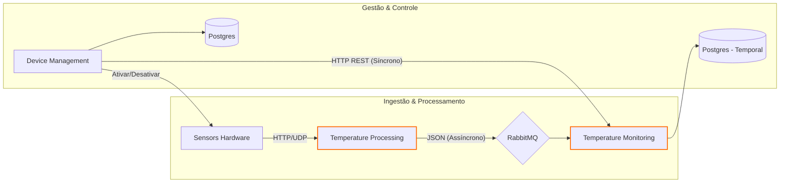

# AlgaSensors - Monitoramento de Temperatura com Microsserviços 🌡️

Este ecossistema de microsserviços foi desenvolvido para resolver problemas críticos de escalabilidade e centralização de dados no monitoramento de sensores. O projeto aplica os princípios da **Arquitetura Hexagonal** e comunicação orientada a eventos com **RabbitMQ**.

---

## 🎯 Objetivos do Projeto
*   **Escalabilidade Independente:** Capacidade de escalar serviços de processamento separadamente da gestão.
*   **Isolamento de Falhas:** Garantir que a instabilidade em um sensor não afete o gerenciamento central.
*   **Processamento em Tempo Real:** Eficiência no tratamento de grandes volumes de dados térmicos.

---

## 🏗️ Arquitetura do Sistema

O sistema reflete a necessidade de separar a **Ingestão de Dados** (alto volume) da **Gestão de Negócio**.



---

## 📦 Detalhamento dos Microsserviços

### 1. Device Management Service
*   **Responsabilidade:** Gestão centralizada (cadastro, ativação e configuração) de sensores.
*   **Comunicação Síncrona:** Envia requisições REST para o *Monitoring* para desativar alertas caso um sensor seja removido.
*   **Principais Endpoints:** `POST /api/sensors`, `PUT /api/sensors/{id}/enable`.

### 2. Temperature Processing Service
*   **Responsabilidade:** Recebimento de dados brutos em tempo real. Projetado para suportar **grande volume de requisições**.
*   **Fluxo:** Valida os dados recebidos e publica mensagens no **RabbitMQ**.
*   **Endpoint Principal:** `POST /api/sensors/{id}/temperatures/data`.

### 3. Temperature Monitoring Service
*   **Responsabilidade:** Inteligência do negócio. Analisa o histórico e gerencia alertas de oscilação.
*   **Persistência:** Armazena o log de temperaturas em um banco temporal para análise de tendências.
*   **Recursos:** Configuração de limites (Max/Min) e disparos de alertas.

---

## 🛠️ Stack Técnica
*   **Linguagem:** Java 17
*   **Framework:** Spring Boot 3
*   **Build Tool:** Gradle
*   **Mensageria:** RabbitMQ
*   **Banco de Dados:** PostgreSQL (Persistência de sensores e logs históricos)
*   **Infraestrutura:** Docker & Docker Compose

---

## 🚀 Como Executar

1.  **Subir Infraestrutura:**
    ```bash
    docker-compose up -d
    ```
2.  **Executar um Serviço (ex: Device Management):**
    ```bash
    cd microservices/device-management
    ./gradlew bootRun
    ```

---

## 🧩 Comunicação entre Serviços
*   **Assíncrona (RabbitMQ):** O *Processing* notifica o *Monitoring* sobre novas temperaturas sem bloquear a recepção de novos dados.
*   **Síncrona (HTTP/REST):** O *Device Management* coordena estados críticos diretamente com os outros serviços para garantir consistência imediata.

---

## ⚖️ Licença
Este projeto possui fins estritamente didáticos.
